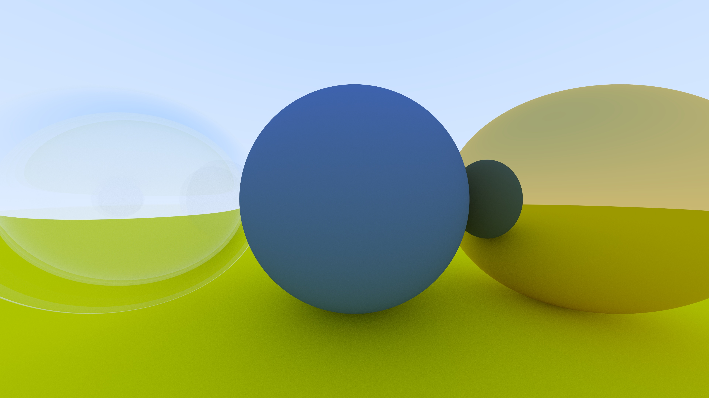
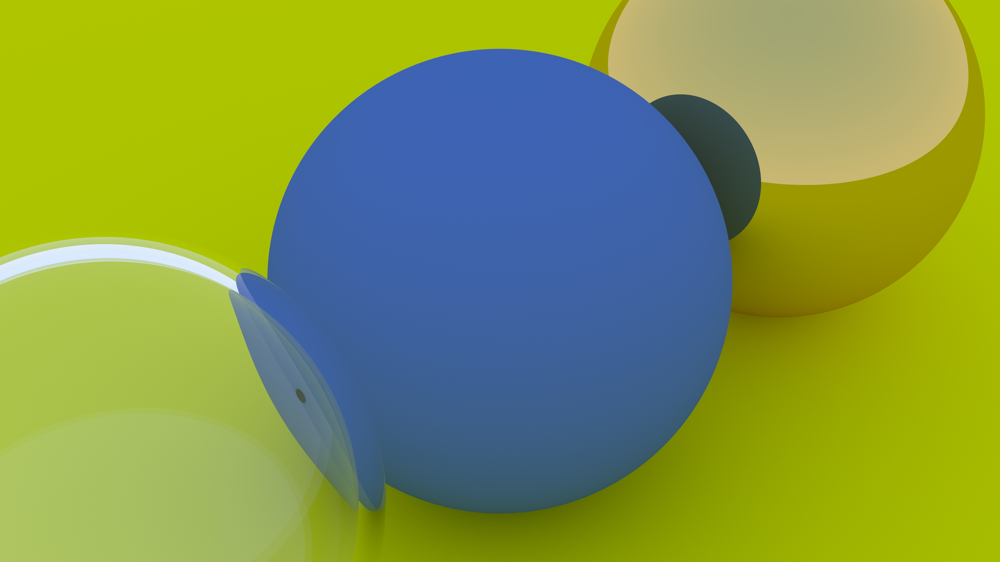
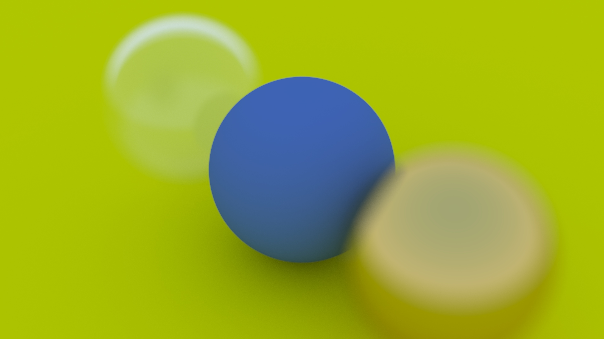
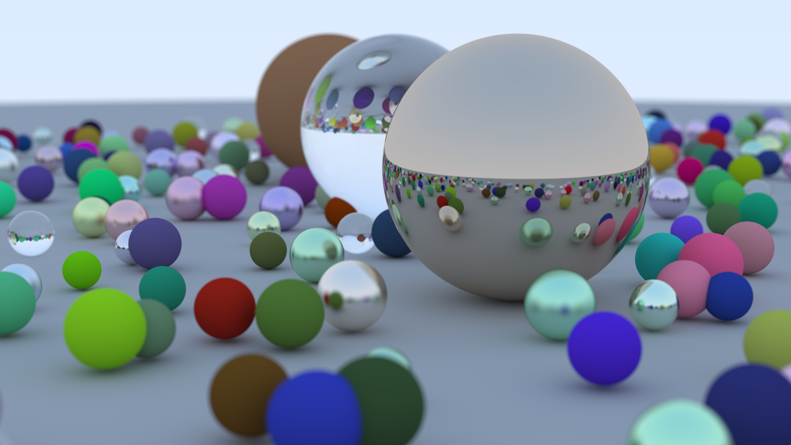
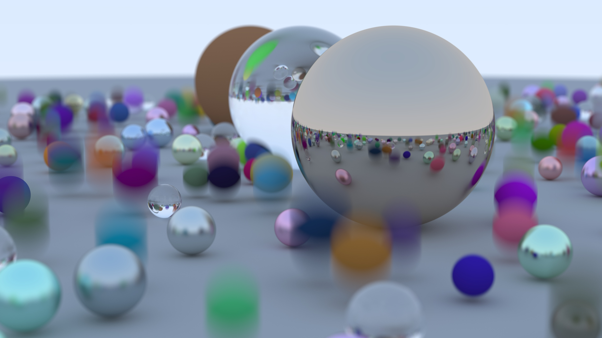
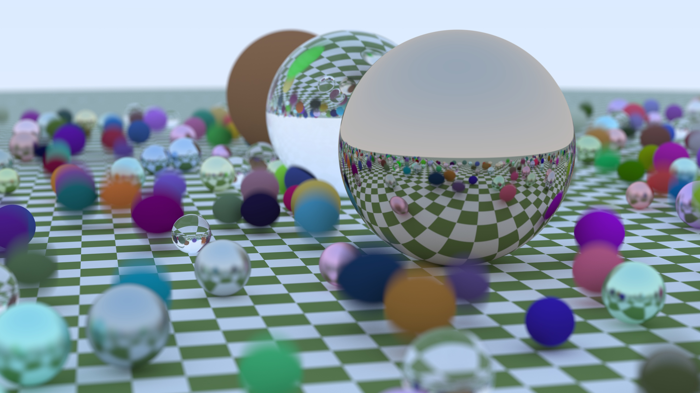
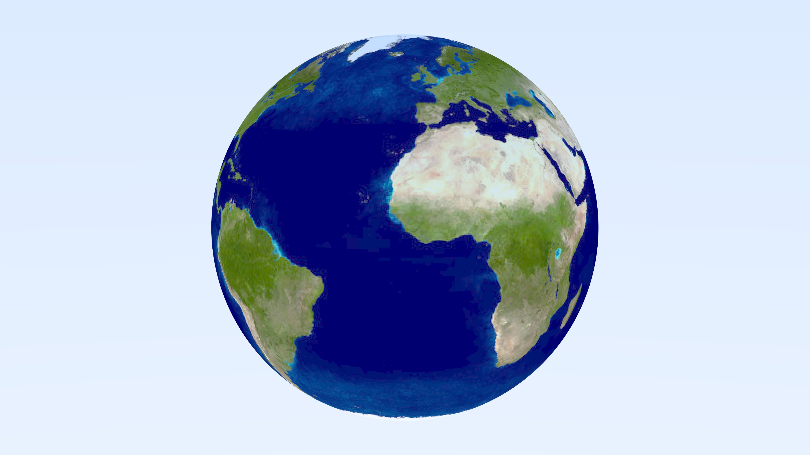
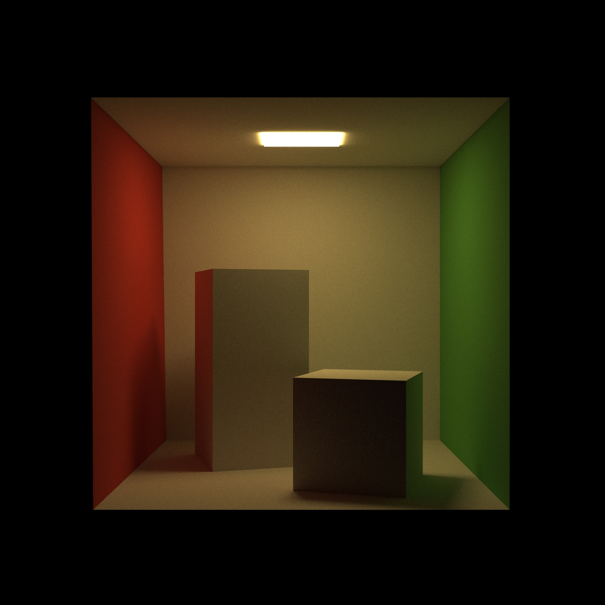
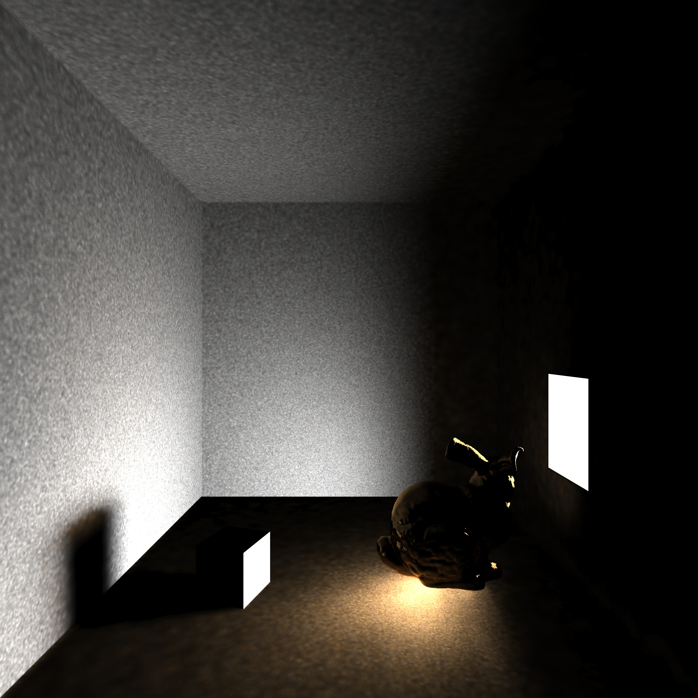

# Renderer Usage
## Usage on Windows
+  step 1: compile this project using cmake 
+  step 2: run "Project.exe 8", here 8 means using 8 threads (after running we will get 8 .partial files) 
+  step 3: run "packager.exe 8", here 8 means combining 8 partial files (after running we will get a .ppm image, which can be opened using OpenSeeIt) 
+  step 4: run python convert.py, which converts .ppm into .jpg (note that opencv for python is required to run this) 

## Usage on Linux
 run "bash linux_run.sh", which compiles the renderer, uses 80 processes to run it and process result into a .ppm and a .jpg file. (Note that for default Sponza Crytek scene, about 150 GB memory is required. This requirement is proportional to the number of processes.) 

\
 **NOTE: For detailed usage and code explanation, see ./report/report.pdf.** 

# Results
##  1. Hollow Glass Ball 

 This scene shows the usage of Lambertian (pure diffuse), Metallic (pure reflection) and Dielectric (refraction) material. 

##  2. Hollow Glass Ball Small FOV 

 This scene is identical to the last one, but with smaller camera FOV. Note that edge of the dielectric ball has reflection rather than refraction, which is physically accurate. 

##  3. Hollow Glass Ball Off Focus 

 This scene shows off-focus blur effect. 

##  4. Many Balls 

 This scene contains many balls. Note that metallic material can use fuzziness to simulate imperfect reflection. 

##  5. Motion Blur 

 This scene shows motion blur effect. 

##  6. Motion Blur Checker 

 This scene adds a simple procedural texture (checker texture) to the last one. 

##  7. Earth 

 This scene is a ball with image texture. 

##  8. Cornell Box Series 

 This is an empty Cornell Box constructed with axis-aligned rectangles. 

 Added two boxes to the last scene. 

 Add rotation to the two boxes. Color bleeding is obvious on two surfaces facing walls. 

 This scene replace the two original boxes with participating media boxes. These boxes are assigned with isotropic material to simulate the effect of smoke. This is a technique often used in volumetric rendering. 

##  9. Book2 Final 

 This scene is a modified version of the one used by Peter Shirley in Ray Tracing Mini-Books 2. It combines may techniques. The whole scene is filled with thin smoke, rendered using participating media. The orange ball on the top left shows motion blur. The earth ball shows image textures. The marble ball in the middle is a complex example of procedural texture computed using Perlin noise. The box on the top right contains 10000 balls as components and use BVH to accelerate. 

##  10. Test Obj 

 A simple scene used in obj test. This Cornell Box is made of triangles. It is stored in a .obj file (with material description in .mtl file) and imported using Tinyobjloader. 

##  11. Sponza Sun 

 This scene is a more complicated one with image textures. Note that in this scene, a biased sampling technique is used such that the sun gets more samples. 

##  12. Sponza Crytek Series 

 This scene is a remastered version of the last one from Crytek cooperation. It is rendered unbiasedly with Path Tracing. Note that bump map is enabled to add more details to the geometry (like the lion in the back). The following one is the same scene with a more complicated skybox. It can be used to simulate extremely sunny weather. 

##  13. Photon Mapping Series 
 A bunny rendered using Photon Mapping. When rendering the first image, photon tracing depth is set to one so that the caustic effect can be seen clearly. The correct effect is shown in the second image. 

